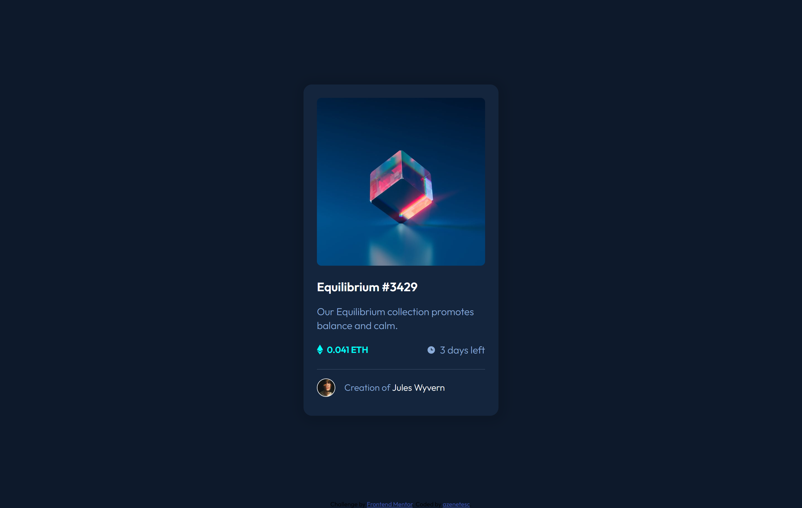
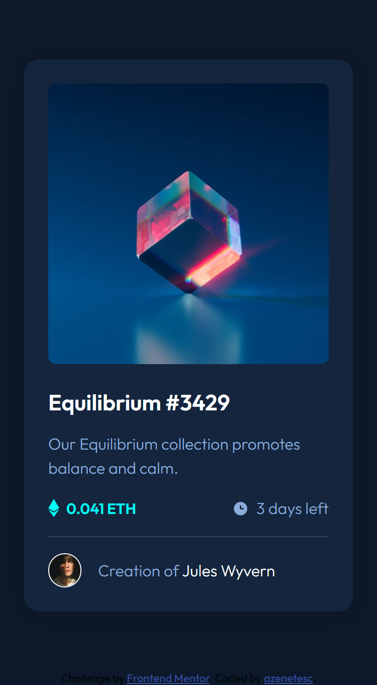

# Frontend Mentor - NFT preview card component solution

This is a solution to the [NFT preview card component challenge on Frontend Mentor](https://www.frontendmentor.io/challenges/nft-preview-card-component-SbdUL_w0U).

## Table of contents

- [Overview](#overview)
  - [Screenshot](#screenshot)
  - [Links](#links)
- [My process](#my-process)
  - [Built with](#built-with)
  - [Useful resources](#useful-resources)
- [Author](#author)

## Overview

### Screenshot

  <h3>My solution</h3> 
 

### Links

- Solution URL: [FrontEnd Mentor: My Solution](https://github.com/azenetesc/nft-preview-card)
- Live Site URL: [GitHub Page: NFT Preview Card](https://azenetesc.github.io/nft-preview-card/)

## My process

### Built with

- Semantic HTML5 markup
- SASS
- Flexbox
- Mobile-first workflow

### Useful resources

- [SASS Built-In Modules](https://sass-lang.com/documentation/modules/math) - This helped me with sass functions.

## Author

- Frontend Mentor - [@azenetesc](https://www.frontendmentor.io/profile/azenetesc)
